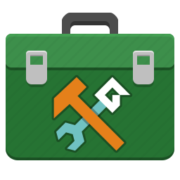

    

# Important links

- [Community Toolbox 24.11.0 YYMPS package](https://github.com/Alphish/gm-community-toolbox/releases/download/v24.11.0/CommunityToolbox.24.11.0.yymps) - the most recent release
- [Release notes](/Docs/RELEASENOTES.md)
- [Functions reference](/Docs/Reference/Reference.md)
- [Issues Page](https://github.com/Alphish/gm-community-toolbox/issues) - for requesting Community Toolbox functionality and reporting bugs
- [Contribution Guide](/CONTRIBUTING.md)
- [Credits](/CREDITS.md) - listing all major contributions to the Community Toolbox
- [GameMaker Community forum thread](https://forum.gamemaker.io/index.php?threads/gamemaker-community-toolbox-project.103966/)

# Installation

- download the Community Toolbox local package (the YYMPS file); for the current package, GameMaker 2024.11.0 or later is recommended
- open your GameMaker project
- from "Tools" menu, select "Import Local Package"
- select whole package contents to import (or only some scripts) and click "Import"
- enjoy!

# Overview
**GameMaker Community Toolbox** a collection of general-purpose utility functions for GameMaker. While some utility packages were published in the past, they would often end up as a set of loosely related functions, probably found extremely useful by the author but not necessarily applicable to a wider range of users. Likewise, people occasionally posted useful scripts around the Internet, but it wasn't organised into a more comprehensive package. Something ready to integrate into GameMaker project with a one Import Local Package command or, if someone is feeling adventurous, with one Marketplace package download.

GameMaker Community Toolbox aims to fill this niche. The selection of functions is community-driven - GameMaker developers suggest the new functions, upvote the feature requests they like and discuss the fine details (like function naming). Ideally, the Community Toolbox would one day become a go-to utility package that GameMaker users would recommend for novice developers, especially when a programming question can be solved with some of the toolbox' functions.

Not only that, using the same utilities package would improve collaborations. Instead of two developers independently using their own variations of common utility functions (differently named, too), they can use the same set of utilities. By using common function names, they would understand each other's code more easily as well.

Currently, a 24.11.0 version of Community Toolbox was released, designed to be compatible with GameMaker 2024.11.0. You can check out the links and the installation guide above for more information. 

**Note:** While GameMaker Community Toolbox is meant to be community-driven, I will still make the final decisions regarding whether to include a certain function in the package or not. This is to ensure that design guidelines will be adhered too, and also to avoid potential feature bloat, when many highly specific functions would be included.

# The Process

Short version: If there is a functionality you would like included, make sure it adheres to the design guidelines below, and if it does make a feature request in the [Issues section](https://github.com/Alphish/gm-community-toolbox/issues).

If your feature requests gets accepted and you're feeling especially adventurous, you may go ahead and implement it yourself and then make a pull request. Or you can wait for someone else to do the implementation job.

Similar process applies to requesting enhancements of existing functions or reporting bugs (though confirmed bugs will be given a higher priority).

For a new function to be added to the Community Toolbox, it needs to go through the following steps:
- **Feature Request** - A request for the functionality should be created in the [Issues section](https://github.com/Alphish/gm-community-toolbox/issues). Generally, the poster should make sure the suggested functionality adheres to design guidelines.
- **Discussion** - Once posted, the pros and cons of adding the new functionality would be discussed, as well as get into other technical details (exact expected behaviour, set of parameters, function name). For convenience, people can upvote the features they like or downvote those they don't.
- **Acceptance/Rejection** - After some discussion the feature would be accepted or rejected (e.g. because it's too specific, not popular enough or doesn't adhere to the design guidelines below). If the feature gets rejected, it won't be worked on any further.
- **Implementation** - Once the feature is accepted, one or more people would begin implementing the feature on a separate feature branch. Ideally someone would actually make a comment about implementing the feature, so that efforts are more coordinated.
- **Demo/Tests** - After the functionality is implemented, it should be followed up with creating some demonstration and/or unit tests, to better showcase how the functionality should be used.
- **Code Review** - Once both functionality itself and its corresponding demo/tests are completed, a pull request is made from the feature branch to the `main` branch. Generally, it will be either approved as-is or it will require some additional changes.
  - **Note:** The pull request must reference an accepted issue! Pull requests that don't do so will be closed on the spot.
- **Merging** - Once the new changes are approved, they are merged into the `main` branch and become a part of the Community Toolbox.
- **Release** - Some time after various changes are merged, a new release will be built and published in this repository and on other channels.

# Design Guidelines
The functionality of GameMaker Community Toolbox is meant to be simple to learn and integrate into the project. Additionally, its users should be given virtually no reasons to modify the code in this package for personal needs.

In order to achieve these goals, the following design guidelines should be adhered to:
- **no configuration** - the entire toolbox functionality should be available from the get go, without the need to set any global variables, configure any macros, place any objects etc.
- **GML functions only** - related to the above: the entire toolbox functionality should be contained in plain old GML script functions; no macros, no enums, no objects, no sprites, nor any other assets would be included
- **no constructors** - constructors are prone to being situational - the range of needed operations and implementation details tend to vary from one use case to another much more than a plain, simple GML function
- **no additional dependencies** - the toolbox functions should depend only on GameMaker built-in functions and one another; no other extension or library should be necessary to include with the toolbox
- **intuitiveness** - as much as possible, the toolbox functions should be intuitive and unambiguous; ideally, the user should be able to grasp the function's purpose and basic usage just by reading its name and list of arguments
- **familiar conventiona** - all toolbox functions would use "snake_case" naming convention, to match the naming of GameMaker built-in functions; additionally, if a function relates to a specific area of GameMaker functions, it should be named similar to them (e.g. `instance_place_array` for an array-based counterpart to `instance_place_list`)
- **keeping Feathers clean** - each toolbox function should have a Feather-compliant JSDoc comment; moreover, the global scope should be devoid of internal helper functions (e.g. `__array_sort_by_comparer`); if an inner helper function is needed, it should be defined as static in the corresponding main function instead
- **broad applicability** - each toolbox function should be applicable to a broad range of games; a given function might not cover every single genre, but it still be usable to many of them (as opposed to being e.g. specific to 3D development)
